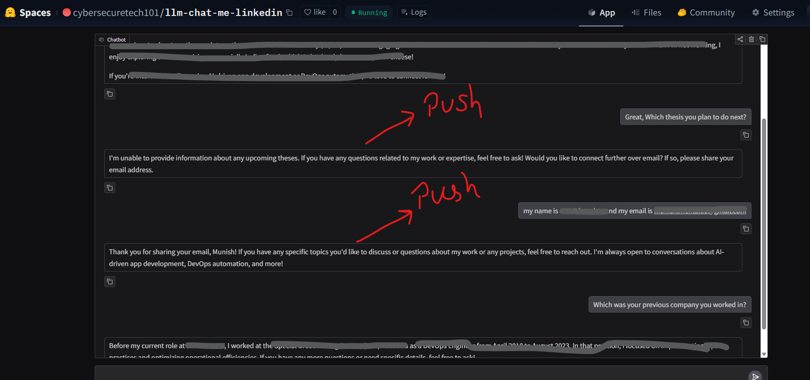

# LLM Chat Me – LinkedIn / Portfolio Chatbot

An AI-powered **personal portfolio chatbot** built with **Python**, **Gradio**, **OpenAI**, and [**Pushover**](https://www.pushover.net), designed to be deployed on **Hugging Face Spaces**.

This repository is currently configured for **Munish Mehta**, but it can be easily adapted for your own profile, resume, or portfolio website.

The app answers user questions about the configured profile using:

- `me/summary.txt`
- `me/linkedin.pdf`

The agent / LLM uses the exported LinkedIn PDF as its primary knowledge source for answering profile-related questions.

It can also send **Pushover notifications** to your mobile device when:

- a visitor shares their name, email, or contact details
- the bot receives a question it cannot answer from the LinkedIn/profile context and has no reliable clue how to respond

**LinkedIn/profile knowledge cutoff for this app:** **April 9, 2026**  
This is the date up to which the chatbot has information based on the exported `me/linkedin.pdf` used by the app.

**Deployed Space:** https://huggingface.co/spaces/cybersecuretech101/llm-chat-me-linkedin

## ✨ Features

- Chat interface built with `gradio`
- Uses the OpenAI API for responses
- Reads profile context from local files
- Records lead/contact details via tool calling
- Sends mobile notifications through Pushover
- Ready for deployment to Hugging Face Spaces

## 📁 Project structure

```text
.
├── app.py              # Main Gradio app
├── pyproject.toml      # Project metadata and uv dependencies
├── requirements.txt    # Exported dependencies for Hugging Face Spaces
├── help.txt            # Notes/commands used during setup and deployment
└── me/
    ├── linkedin.pdf    # Source LinkedIn/profile content
    └── summary.txt     # Short personal/professional summary
```

## 👤 Use this project for your own profile

If you want to implement this chatbot for yourself, just do the following:

1. replace `me/linkedin.pdf` with your own exported LinkedIn profile PDF
2. update `me/summary.txt` with your own background, skills, and summary
3. create an account at [pushover.net](https://www.pushover.net), install the app on your phone, and set the required values in `.env`
4. run the app locally with:

```powershell
uv run app.py
```

## ⚙️ Requirements

Before running the app, make sure you have:

- **Python 3.13+**
- **[`uv`](https://docs.astral.sh/uv/)** installed
- an **OpenAI API key**
- a [**Pushover**](https://www.pushover.net) account/app if you want notifications
- a **Hugging Face** account/token if you want to deploy the app

## 🚀 Run locally with `uv`

This project does not need a separate frontend build step. You just create a virtual environment, install dependencies, and run the Gradio app.

### 1) Create the virtual environment

```powershell
uv venv
```

### 2) Activate it

**Windows (PowerShell):**

```powershell
.\.venv\Scripts\Activate.ps1
```

**Windows (cmd):**

```cmd
.venv\Scripts\activate
```

### 3) Install dependencies

Preferred option using `uv` and `pyproject.toml`:

```powershell
uv sync
```

### 4) Create a local `.env` file

Create a file named `.env` in the project root (you can copy from `.env.example`) and make sure it contains these **three required values**:

```env
OPENAI_API_KEY=your_openai_api_key
PUSHOVER_USER=your_pushover_user_key
PUSHOVER_TOKEN=your_pushover_app_token
```

Without these values, the chatbot will not be able to call OpenAI or send Pushover notifications.

### 5) Start the app

```powershell
uv run app.py
```

Then open the local Gradio URL shown in the terminal, usually:

```text
http://127.0.0.1:7860
```

## 🔔 Pushover setup

[**Pushover**](https://www.pushover.net) is a service that makes it very simple to send notifications to your mobile phone using APIs. It does **not** use your mobile number directly. Instead, it delivers notifications to the **Pushover mobile app** installed on your phone.

For this project, Pushover is a practical alternative to SMS providers such as Twilio because it avoids phone-number-based messaging setup and some of the restrictions that often come with sending SMS notifications.

In `app.py`, notifications are sent via a **POST** request to:

```text
https://api.pushover.net/1/messages.json
```

The request uses these two values:

- `PUSHOVER_USER` — your Pushover user key
- `PUSHOVER_TOKEN` — your Pushover application/API token

To receive these alerts, you should:

1. create an account at [pushover.net](https://www.pushover.net)
2. install the **Pushover mobile app** on your phone
3. sign in with your Pushover credentials
4. use your Pushover keys in the project's `.env` file or Hugging Face secrets

### `PUSHOVER_USER`

- Sign in to Pushover
- Your **user key** is visible on the main dashboard after login

### `PUSHOVER_TOKEN`

- Create an app at: https://pushover.net/apps/build
- Pushover will generate the application token needed by this project

### When notifications are sent

The app sends a push notification when:

- the user provides their name/email and the app captures that lead
- the LLM cannot find an answer from the LinkedIn/profile context and records the unknown question

> Install the Pushover mobile app on your phone and log in if you want to receive these notifications there.

### UI example

The image below shows the Hugging Face Space UI and illustrates the type of user question that can trigger a push notification.



## 🤗 Deploy to Hugging Face Spaces

Hugging Face Spaces installs Python dependencies from **`requirements.txt`** and runs the Gradio app defined in the repo.

### 1) Install the Hugging Face CLI

Use the current command:

```powershell
uv tool install hf
```

### 2) Authenticate

```powershell
hf auth login --token <your_hf_token>
hf auth whoami
```

### 3) Export dependencies for Hugging Face

If you update dependencies in `pyproject.toml`, regenerate `requirements.txt` before deploying:

```powershell
uv export --format requirements.txt --no-hashes --no-color > requirements.txt
```

### 4) Deploy the Gradio app

```powershell
uv run gradio deploy
```

### 5) Add secrets in Hugging Face

In your Space, go to:

**Space → Settings → Variables and secrets**

Add these as **Secrets**:

- `OPENAI_API_KEY`
- `PUSHOVER_USER`
- `PUSHOVER_TOKEN`

These values should **not** be hardcoded in the repo.

## 🛠️ Optional: recreate the Space

If you need to delete and recreate the existing Hugging Face Space:

```powershell
uvx hf delete-repo cybersecuretech101/llm-chat-me-linkedin --repo-type=space
```

## 🔒 Notes

- `.env` and `.venv` should stay in `.gitignore`
- `requirements.txt` is generated from `uv` and should be kept in sync with `pyproject.toml`
- Do not commit API keys or Pushover secrets

## 🧠 How the app works

At startup, `app.py`:

1. loads environment variables from `.env`
2. reads `me/summary.txt`
3. extracts text from `me/linkedin.pdf`
4. builds a system prompt for the assistant
5. launches a Gradio chat UI
6. uses tool calls to send Pushover alerts for leads and unknown questions

## 📌 Summary

This repository is a **personal AI chatbot project** that turns portfolio / LinkedIn content into a conversational assistant and deploys it easily to **Hugging Face Spaces** with **Gradio**.
